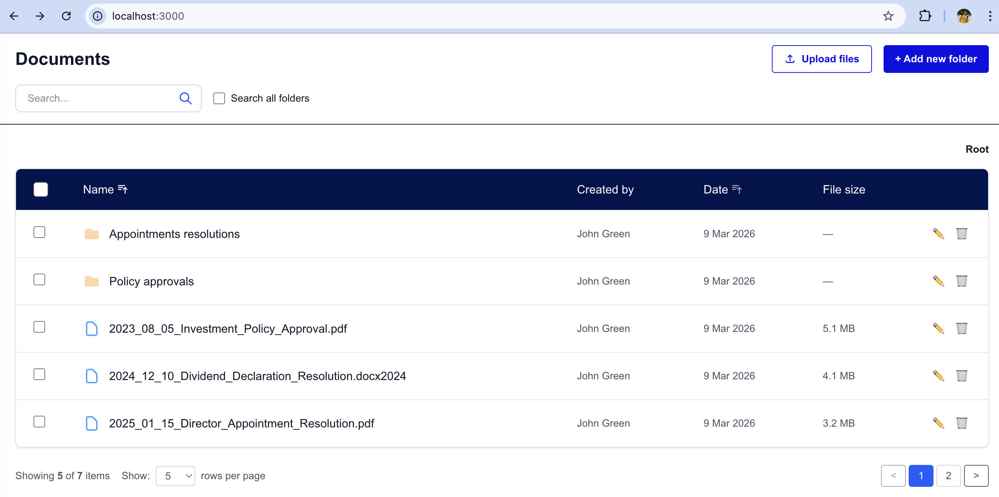
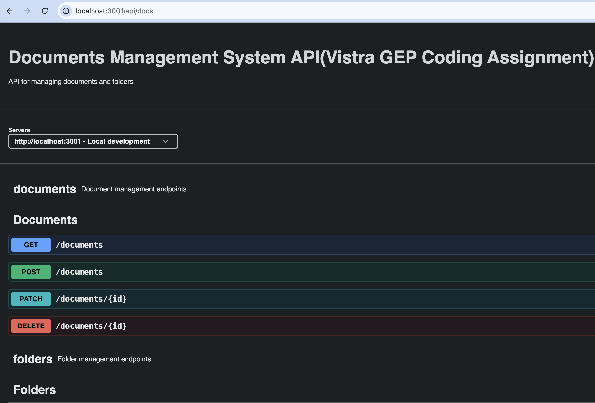

# Vistra GEP Coding Assignment: Documents Management System

A simple hierarchical **Documents Management System (DMS)** simulating folders and documents (no real file uploads).


> Live demo at http://localhost:3000 after setup


> Interactive docs at http://localhost:3001/api/docs

## Table of Contents

- [Overview](#overview)
- [Features](#features)
- [Tech Stack](#tech-stack)
- [Prerequisites](#prerequisites)
- [Quick Start](#quick-start)
- [Manual Setup](#manual-setup)
- [Access Points](#access-points)
- [Database & Reset](#database--reset)
- [Running Tests](#running-tests)

## Overview
This project implements a basic Documents Management System as per the Vistra GEP assignment. It includes a frontend UI for viewing and adding folders/documents, and a backend API for data management using MySQL. No actual file uploads are implemented—only simulated records.

## Features
- Hierarchical folder/document structure (parent-child relationships)
  View items in current folder
- Add new folders and documents with form validation
- [Bonus] Global and folder-level search
- Responsive UI
- Swagger API documentation
- Prisma migrations and MySQL via Docker
-Unit/integration tests for frontend and backend


## Tech Stack
- **Frontend**: Next.js 14+ (App Router), TypeScript, Tailwind CSS, React Hook Form, Zod
- **Backend**: NestJS, TypeScript, Prisma ORM
- **Database**: MySQL 8 (Dockerized)
- **Tools**: Tools: Docker Compose, Jest, Swagger/OpenAPI, class-validator, class-transformer

## Prerequisites
- Node.js ≥ 22
- npm ≥ 9
- Docker & Docker Compose 
- Git

## Quick Start
```bash
git clone https://github.com/mugeesh/vistra-gep-coding-assignment-dms.git
cd vistra-gep-coding-assignment-dms

# Make script executable and run
chmod +x start-all.sh
./start-all.sh
```
This starts the database, backend, and frontend automatically. 
Access at:
- Frontend UI: http://localhost:3000
- API Docs (Swagger): http://localhost:3001/api/docs
> [!IMPORTANT]
>
> * **Port Availability:** Ensure ports 3000 and 3001 are available. If these ports are already in use, you can update the PORT or BACKEND_URL variables in the .env files located in the /backend and /frontend directories.
> * **this start-all.sh compatible with Mac PC**, for other please follow Manual Setup
> * if error running start-all.sh script please follow manual setup steps

This starts the database, backend, and frontend automatically.


## Manual Setup
1. **Start the Database (MySQL via Docker)**
   ```bash
    cd backend
    docker compose up -d
   ```
   Wait 10-20 seconds, then verify with docker ps (should show MySQL and Adminer containers).
2. **Backend api setup:**
    ```bash
    cd backend
    cp .env.example .env
    npm install
    npx prisma generate
    npx prisma db push
    
    # Optional: Load seed data
    npm run prisma:seed
    
    # Start in dev mode
    npm run start:dev
     ```
   
3. **Frontend Setup:**
    ```bash
    cd frontend
    cp .env.example .env
    npm install
    npm run dev
    ```
      Bash


## Access Points

Once the application is running:

- **Frontend UI**  
  http://localhost:3000  

- **Backend API**  
  http://localhost:3001

- **Interactive API Documentation (Swagger)**  
  http://localhost:3001/api/docs  
  Explore and test all endpoints interactively

- **Database Admin (Adminer)**  
  http://localhost:8080  
  **Credentials**:
    - System: MySQL
    - Server: `mysql`
    - Username: `root`
    - Password: `rootPassword`
    - Database: `document_management_systems`

## Database & Reset
- Schema: Defined in `backend/prisma/schema.prisma` (self-referencing parentId for hierarchy).
- Migrations: Applied via Prisma on backend start.
- Reset: Drops tables, re-applies migrations (use with caution):
- Seed data (optional demo items) may be applied depending on your `start-all.sh` / `start-dev.sh` implementation.
    ```
    cd backend
    npx prisma migrate reset --force
    ```
**Reset the database** (drops all tables, re-applies migrations, optional re-seed):

### Project Structure
- `backend/`:
  - `src/`: Controllers, services, modules
  -` prisma/`: Schema, migrations, seeds
  - `test/`: Integration/unit tests

- `frontend/`:
  - `src/app/`: Pages and layouts
  - `src/components/`: UI components (e.g., ExplorerContainer, AddFolderForm, AddDocumentForm)
  - `src/lib/`: API client
  - `src/types/`: Shared types
  - `src/__tests__/`: Unit/component tests

### Running Tests
Backend (Integration & Unit)
```bash
    cd backend
    npm run test
```
##### Example output:
```
> backend-api@1.0.0 test
> jest --config jest.config.js

 PASS  test/integration/items.service.spec.ts
 PASS  test/integration/documents.controller.spec.ts
 PASS  test/integration/folders.controller.spec.ts
 PASS  test/integration/items.controller.spec.ts
--------------------------|---------|----------|---------|---------|----------------------
File                      | % Stmts | % Branch | % Funcs | % Lines | Uncovered Line #s    
--------------------------|---------|----------|---------|---------|----------------------
All files                 |    62.5 |    34.72 |   52.94 |   61.11 |                      
 common                   |      55 |      100 |       0 |   73.33 |                      
  list-items-query.dto.ts |      55 |      100 |       0 |   73.33 | 12,23,36,76          
 documents                |   43.85 |    11.11 |      20 |   38.77 |                      
  documents.controller.ts |   45.16 |       20 |      40 |   44.44 | 27,43-45,54-59,65-72 
  documents.module.ts     |     100 |      100 |     100 |     100 |                      
  documents.service.ts    |      25 |        0 |       0 |   16.66 | 6-69                 
 documents/dto            |      88 |    28.57 |    62.5 |      88 |                      
  create-document.dto.ts  |   94.11 |       40 |   83.33 |   94.11 | 58                   
  update-document.dto.ts  |      75 |        0 |       0 |      75 | 8,16                 
 folders                  |   56.89 |    26.92 |      50 |   51.92 |                      
  folders.controller.ts   |   68.75 |    38.88 |     100 |   66.66 | 38-42,56-60,76-77    
  folders.module.ts       |     100 |      100 |     100 |     100 |                      
  folders.service.ts      |      25 |        0 |       0 |   16.66 | 10-74                
 folders/dto              |     100 |       50 |     100 |     100 |                      
  create-folder.dto.ts    |     100 |       50 |     100 |     100 | 15-29                
  update-folder.dto.ts    |     100 |       50 |     100 |     100 | 7                    
 items                    |   74.62 |    45.94 |     100 |   72.41 |                      
  items.controller.ts     |     100 |    93.75 |     100 |     100 | 34                   
  items.service.ts        |   68.51 |    32.75 |     100 |   65.95 | 21-23,42-62          
 prisma                   |   31.57 |        0 |       0 |   23.52 |                      
  prisma.service.ts       |   31.57 |        0 |       0 |   23.52 | 6-13,28-54           
--------------------------|---------|----------|---------|---------|----------------------

Test Suites: 4 passed, 4 total
Tests:       25 passed, 25 total
Snapshots:   0 total
Time:        3.514 s, estimated 4 s
Ran all test suites.
```

### Frontend (Unit & Component)
```bash
cd frontend
npm run test
```
##### Example output:
```
> frontend@1.0.0 test
> jest

 PASS  src/__tests__/unit/sorting.test.ts
 PASS  src/__tests__/components/DocumentsTable.test.tsx
 PASS  src/__tests__/components/AddDocumentForm.test.tsx

Test Suites: 3 passed, 3 total
Tests:       4 passed, 4 total
Snapshots:   0 total
Time:        1.275 s
Ran all test suites.
```
